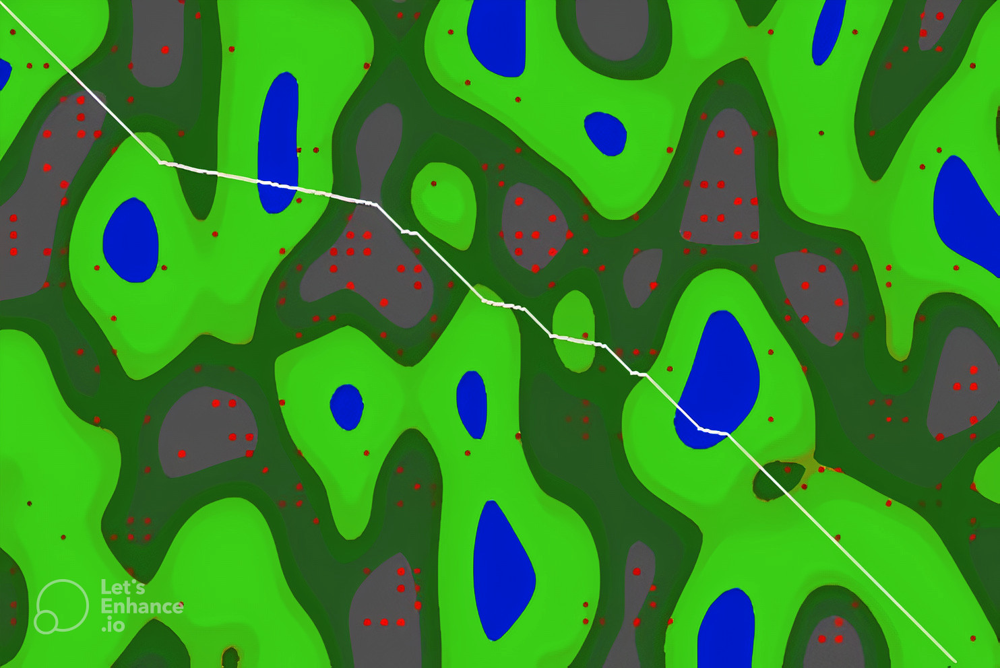
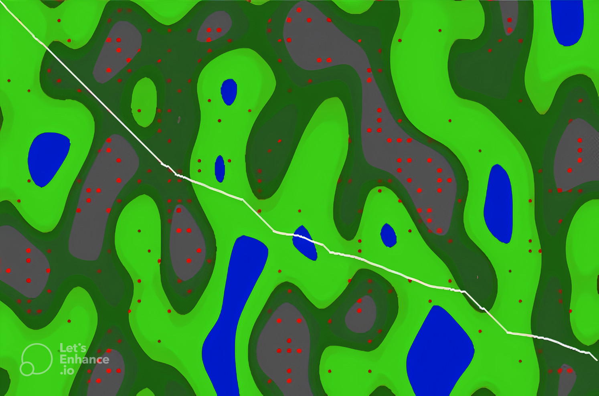

# pb2-miniproject2
Miniproject 2 for PB couse(UCU)

## Description
This project is modeling a road in forest. We use NEAT algorithm to train a neural network to build road through the forest. The main goal is to build a road from start to finish with the least damage to the forest.

## Installation

Use the package manager [pip](https://pip.pypa.io/en/stable/) to install all requirements.

```bash
pip install -r requirements.txt
```

## Usage

You can run file ```builder_feedworward.py``` to train neural network with NEAT algorithm. Wait several minutes to train model and than you will see result in pygame window.

```bash
python builder_feedworward.py
```

## Results

There are several results of training neural network with NEAT algorithm.




## Participants
- Olexandr Ivaniuk
- Mykola Vysotskyi
- Mykytyshyn Yaryna
- Charnosh Veronika
- Bronevitskyi Volodymyr

## License
[MIT](https://choosealicense.com/licenses/mit/)